# Claude Code Proxy

A proxy server that enables **Claude Code CLI** to work with multiple OpenAI-compatible API providers. Convert Claude API requests to OpenAI format, allowing you to use various LLM providers (Kimi, GLM, Gemini, MiniMax, etc.) through Claude Code.

**Version:** 1.2.0

## 🎯 Architecture


## 🔄 Request Flow

```mermaid
sequenceDiagram
    participant CC as Claude Code CLI
    participant P as Proxy Server
    participant RC as Request Converter
    participant MM as Model Mapper
    participant LLM as LLM Provider

    CC->>P: POST /v1/messages<br/>{model: "anthropic/claude-haiku-4-5"}
    P->>RC: Convert request format
    RC->>MM: Map model<br/>"sonnet" → MIDDLE_MODEL
    MM->>LLM: POST /chat/completions<br/>{model: "glm-4"}
    LLM-->>MM: OpenAI response
    MM-->>RC: Convert response
    RC-->>P: Claude format response
    P-->>CC: /v1/messages response
```



## ✨ Features

- 🔌 **Multi-Provider Support**: Kimi, GLM, Gemini, MiniMax, OpenAI, Azure, Ollama, and any OpenAI-compatible API
- 🎭 **Multi-Instance Deployment**: Run multiple proxies simultaneously on different ports
- 🧠 **Smart Model Mapping**: Automatic mapping of Claude models (haiku/sonnet/opus) to target models
- 🔄 **Streaming Support**: Real-time SSE streaming for all providers
- 🛠️ **Function Calling**: Complete tool use support with format conversion
- 🖼️ **Image Support**: Base64 encoded image input handling
- 🎯 **Custom Headers**: Inject custom HTTP headers for API requests
- 📊 **Health Checks**: Built-in health endpoints with detailed status
- 🪵 **Auto Log Management**: Automatic log archival and cleanup (3-day retention)

## 🚀 Quick Start

**Requirements:**
- **Python**: 3.12 or higher (supports 3.12, 3.13)
- **Package Manager**: UV (recommended) or pip
- **Requesty.ai API Key**: Get from [Requesty.ai](https://requesty.ai)

This proxy uses **Requesty.ai** as a unified router to access multiple LLM providers with a single API key.

### Step 1: Install Dependencies

```bash
# Using UV (recommended)
uv sync

# Or using pip
pip install -r requirements.txt
```

### Step 2: Configure API Keys

All proxies use **Requesty.ai** as the unified router - only one API key needed to access multiple providers.

#### Kimi-K2 (Port 8081)
```bash
cp .env.example .env-requesty-kimi-k2
nano .env-requesty-kimi-k2
```
Configuration:
```bash
# Requesty.ai API Key (shared by all proxies)
OPENAI_API_KEY="sk-your-requesty-api-key"
OPENAI_BASE_URL="https://router.requesty.ai/v1"

# Kimi model settings (routed through Requesty.ai)
BIG_MODEL="groq/moonshotai/Kimi-K2-Instruct-0905"
MIDDLE_MODEL="groq/moonshotai/Kimi-K2-Instruct-0905"
SMALL_MODEL="groq/moonshotai/Kimi-K2-Instruct-0905"

# Port settings
PORT="8081"

# Required custom headers (avoid 403 errors)
CUSTOM_HEADER_USER_AGENT="Mozilla/5.0 (compatible; ClaudeCodeProxy/1.0)"
CUSTOM_HEADER_ACCEPT="application/json"

# Client validation (optional)
ANTHROPIC_API_KEY="dummy"
```

#### GLM-4.6 (Port 8082)
```bash
cp .env.example .env-requesty-glm
nano .env-requesty-glm
```
Configuration:
```bash
# Requesty.ai API Key (shared by all proxies)
OPENAI_API_KEY="sk-your-requesty-api-key"
OPENAI_BASE_URL="https://router.requesty.ai/v1"

# GLM model settings (routed through Requesty.ai)
BIG_MODEL="zai/GLM-4.6"
MIDDLE_MODEL="zai/GLM-4.6"
SMALL_MODEL="zai/GLM-4.6"

# Port settings
PORT="8082"

# Required custom headers (avoid 403 errors)
CUSTOM_HEADER_USER_AGENT="Mozilla/5.0 (compatible; ClaudeCodeProxy/1.0)"
CUSTOM_HEADER_ACCEPT="application/json"

# Client validation (optional)
ANTHROPIC_API_KEY="dummy"
```

#### Gemini 2.5 Flash (Port 8084)
```bash
cp .env.example .env-requesty-gemini
nano .env-requesty-gemini
```
Configuration:
```bash
# Requesty.ai API Key (shared by all proxies)
OPENAI_API_KEY="sk-your-requesty-api-key"
OPENAI_BASE_URL="https://router.requesty.ai/v1"

# Gemini model settings (routed through Requesty.ai)
BIG_MODEL="google/gemini-2.5-flash"
MIDDLE_MODEL="google/gemini-2.5-flash"
SMALL_MODEL="google/gemini-2.5-flash"

# Port settings
PORT="8084"

# Required custom headers (avoid 403 errors)
CUSTOM_HEADER_USER_AGENT="Mozilla/5.0 (compatible; ClaudeCodeProxy/1.0)"
CUSTOM_HEADER_ACCEPT="application/json"

# Client validation (optional)
ANTHROPIC_API_KEY="dummy"
```

#### MiniMax-M2 (Port 8083)
```bash
cp .env.example .env-requesty-minimax-m2
nano .env-requesty-minimax-m2
```
Configuration:
```bash
# Requesty.ai API Key (shared by all proxies)
OPENAI_API_KEY="sk-your-requesty-api-key"
OPENAI_BASE_URL="https://router.requesty.ai/v1"

# MiniMax model settings (routed through Requesty.ai)
BIG_MODEL="minimaxi/MiniMax-M2"
MIDDLE_MODEL="minimaxi/MiniMax-M2"
SMALL_MODEL="minimaxi/MiniMax-M2"

# Port settings
PORT="8083"

# Required custom headers (avoid 403 errors)
CUSTOM_HEADER_USER_AGENT="Mozilla/5.0 (compatible; ClaudeCodeProxy/1.0)"
CUSTOM_HEADER_ACCEPT="application/json"

# Client validation (optional)
ANTHROPIC_API_KEY="dummy"
```

### Step 3: Start Proxy Services

#### Method 1: Using Startup Script (Recommended)

`start-all-proxies.sh` is pre-configured to start all proxies:

```bash
# Check script configuration
cat start-all-proxies.sh | grep "PROXIES="
# Should see:
# PROXIES=(
#     "8081:.env-requesty-kimi-k2:Kimi-K2"
#     "8082:.env-requesty-glm:GLM-4.6"
#     "8083:.env-requesty-minimax-m2:MiniMax-M2"
#     "8084:.env-requesty-gemini:Gemini-2.5-Flash"
# )

# Start all proxies
./start-all-proxies.sh start

# Check status (shows model configuration for each proxy)
./start-all-proxies.sh status
```

#### Method 2: Manual Single Proxy Startup

```bash
# Start GLM-4.6 proxy
python start_proxy.py --env .env-requesty-glm

# Start Kimi-K2 proxy
python start_proxy.py --env .env-requesty-kimi-k2

# Start Gemini proxy
python start_proxy.py --env .env-requesty-gemini

# Start MiniMax proxy
python start_proxy.py --env .env-requesty-minimax-m2
```

### Step 4: Use with Claude Code

After successful startup, choose which proxy to use and set environment variables:

#### Using GLM-4.6 (Port 8082)
```bash
export ANTHROPIC_BASE_URL=http://localhost:8082
export ANTHROPIC_API_KEY=dummy
claude
```

#### Using Kimi-K2 (Port 8081)
```bash
export ANTHROPIC_BASE_URL=http://localhost:8081
export ANTHROPIC_API_KEY=dummy
claude
```

#### Using Gemini (Port 8084)
```bash
export ANTHROPIC_BASE_URL=http://localhost:8084
export ANTHROPIC_API_KEY=dummy
claude
```

#### Using MiniMax (Port 8083)
```bash
export ANTHROPIC_BASE_URL=http://localhost:8083
export ANTHROPIC_API_KEY=dummy
claude
```

## 🧪 Testing & Health Checks

### Health Check
```bash
# Check all proxies (shows actual model configuration)
curl http://localhost:8081/health | jq
curl http://localhost:8082/health | jq
curl http://localhost:8083/health | jq
curl http://localhost:8084/health | jq
```

Health check response example:
```json
{
  "status": "healthy",
  "timestamp": "2025-11-08T10:30:00.123456",
  "server": {
    "host": "0.0.0.0",
    "port": 8082
  },
  "models": {
    "big_model": "zai/GLM-4.6",
    "middle_model": "zai/GLM-4.6",
    "small_model": "zai/GLM-4.6"
  },
  "api_status": {
    "openai_api_configured": true,
    "api_key_valid": true,
    "client_api_key_validation": true,
    "openai_base_url": "https://router.requesty.ai/v1"
  }
}
```

### Quick Test
```bash
# Test GLM-4.6
curl -X POST http://localhost:8082/v1/messages \
  -H "Content-Type: application/json" \
  -H "x-api-key: dummy" \
  -H "anthropic-version: 2023-06-01" \
  -d '{
    "model": "anthropic/claude-haiku-4-5",
    "max_tokens": 100,
    "messages": [{"role": "user", "content": "你好"}]
  }'
```

## 📋 Requesty.ai Model Routing Table

All proxies use Requesty.ai as the unified router, actual model format:

| Service Name | Port | Requesty.ai Model Path | Environment Config |
|-------------|------|------------------------|-------------------|
| Kimi-K2 | 8081 | `groq/moonshotai/Kimi-K2-Instruct-0905` | .env-requesty-kimi-k2 |
| GLM-4.6 | 8082 | `zai/GLM-4.6` | .env-requesty-glm |
| MiniMax-M2 | 8083 | `minimaxi/MiniMax-M2` | .env-requesty-minimax-m2 |
| Gemini 2.5 | 8084 | `google/gemini-2.5-flash` | .env-requesty-gemini |

**Note:** All proxies use the same Requesty.ai API key - only need to configure once.

## 🔧 Management Commands

```bash
# Start all proxies
./start-all-proxies.sh start

# Stop all proxies
./start-all-proxies.sh stop

# Restart all proxies
./start-all-proxies.sh restart

# Check proxy status (shows actual model settings and API URL)
./start-all-proxies.sh status

# Clean old logs (older than 3 days)
./start-all-proxies.sh clean-logs
```

## 📊 View Logs

```bash
# View real-time logs
tail -f logs/GLM-4.6.log
tail -f logs/Kimi-K2.log
tail -f logs/MiniMax-M2.log
tail -f logs/Gemini-2.5-Flash.log

# View all proxy logs
tail -f logs/*.log
```

## ⚙️ Important Configuration Notes

### Required Custom Headers for Requesty.ai

Requesty.ai requires specific HTTP headers to avoid 403 errors:

```bash
# These two headers must be set
CUSTOM_HEADER_USER_AGENT="Mozilla/5.0 (compatible; ClaudeCodeProxy/1.0)"
CUSTOM_HEADER_ACCEPT="application/json"
```

### API Key Explanation

- **OPENAI_API_KEY**: Set to your Requesty.ai API key (shared by all proxies)
- **ANTHROPIC_API_KEY**: Set to `dummy` (for Claude Code client validation)

### Port Allocation

Ensure each proxy uses different ports to avoid conflicts:
- Kimi-K2: 8081
- GLM-4.6: 8082
- MiniMax-M2: 8083
- Gemini 2.5: 8084

## 🔗 Requesty.ai Model Format

Requesty.ai uses special model path format: `provider/vendor/model-name`

Examples:
- `groq/moonshotai/Kimi-K2-Instruct-0905` - Moonshot AI's Kimi model
- `zai/GLM-4.6` - Zhipu AI's GLM model
- `google/gemini-2.5-flash` - Google's Gemini model
- `minimaxi/MiniMax-M2` - MiniMax's model

For complete list of available models, refer to [Requesty.ai documentation](https://requesty.ai).

## 💡 Tips

- ✅ All proxies use the same Requesty.ai API key
- ✅ Must set custom headers to avoid 403 errors
- ✅ Each proxy uses different ports
- ✅ Regularly clean log files (auto 3-day retention)
- ✅ Use `status` command to check all services are running
- ✅ Log files located in `logs/` directory

## 🚨 Troubleshooting

### 403 Forbidden Error

If you encounter 403 errors, confirm required headers are set:
```bash
CUSTOM_HEADER_USER_AGENT="Mozilla/5.0 (compatible; ClaudeCodeProxy/1.0)"
CUSTOM_HEADER_ACCEPT="application/json"
```

### Port Already in Use

```bash
# Check processes using ports
lsof -i :8081
lsof -i :8082
lsof -i :8083
lsof -i :8084

# Or use script to handle automatically
./start-all-proxies.sh start
# Script will automatically ask to terminate conflicting processes
```

### Invalid API Key

Confirm your Requesty.ai API key is valid:
```bash
# Check health status
curl http://localhost:8082/health | jq '.api_status'
```

## 🧪 Additional Testing

```bash
# Run unit tests
python -m pytest tests/
```

## 🐛 Debug Mode

Need detailed logs? Set in environment configuration file:
```bash
LOG_LEVEL="DEBUG"
```

Then restart the corresponding proxy.

**Debug output includes:**
- Request/response logs
- Header transformations
- Model mapping decisions
- API call details

## 📁 Project Structure

```
claude-code-proxy/
├── src/
│   ├── main.py                   # FastAPI application
│   ├── api/
│   │   └── endpoints.py          # API endpoints
│   ├── core/
│   │   ├── config.py             # Configuration
│   │   ├── client.py             # OpenAI client
│   │   └── model_manager.py      # Model mapping
│   ├── conversion/
│   │   ├── request_converter.py  # Claude → OpenAI
│   │   └── response_converter.py # OpenAI → Claude
│   └── models/
│       ├── claude.py             # Claude schemas
│       └── openai.py             # OpenAI schemas
├── tests/                        # Unit tests
├── logs/                         # Auto-managed logs (3-day retention)
├── pids/                         # Process ID files
├── start_proxy.py                # Single proxy launcher
├── start-all-proxies.sh          # Multi-proxy manager
├── setup-log-cleanup-cron.sh     # Cron setup for log cleanup
└── .env.example                  # Configuration template
```

## 🔧 Development

```bash
# Install with dev dependencies
uv sync

# Run server
uv run claude-code-proxy

# Format code
uv run black src/
uv run isort src/

# Type checking
uv run mypy src/
```

## 🚀 Performance

- ⚡ **Async/await** architecture for high concurrency
- 🔄 **Connection pooling** for efficiency
- 📊 **Streaming support** with proper backpressure handling
- ⏱️ **Configurable timeouts** and retries
- 🛡️ **Smart error handling** with detailed logging
- 🗂️ **Auto log rotation** (3-day retention)

## 📚 Documentation

- [QUICKSTART.md](QUICKSTART.md) - Detailed quick start guide (Chinese)
- [START_PROXIES.md](START_PROXIES.md) - Multi-proxy management guide
- [CLAUDE.md](CLAUDE.md) - Development and architecture documentation

## 🙏 Acknowledgments

This project is based on the original work by [fuergaosi233](https://github.com/fuergaosi233/claude-code-proxy). We are grateful for their contribution to the open-source community and for creating the foundation upon which this project is built.

## 📄 License

MIT License

---

**Project Repository:** https://github.com/zoonderkins/claude-code-proxy
