# Claude Code Proxy

A proxy server that enables **Claude Code CLI** to work with multiple OpenAI-compatible API providers. Convert Claude API requests to OpenAI format, allowing you to use various LLM providers (Kimi, GLM, Gemini, MiniMax, etc.) through Claude Code.

**Version:** 1.1.0

## 🎯 Architecture

```mermaid
graph TB
    subgraph "Claude Code CLI"
        CC[Claude Code]
    end

    subgraph "Proxy Server (Multi-Instance)"
        P1[Proxy :8081<br/>Kimi-K2]
        P2[Proxy :8082<br/>GLM-4.6]
        P3[Proxy :8083<br/>MiniMax-M2]
        P4[Proxy :8084<br/>Gemini-2.5]
    end

    subgraph "Format Conversion"
        RC[Request Converter<br/>Claude → OpenAI]
        MM[Model Mapper<br/>haiku/sonnet/opus → target models]
        RP[Response Converter<br/>OpenAI → Claude]
    end

    subgraph "LLM Providers"
        K[Moonshot AI<br/>Kimi]
        G[ZhipuAI<br/>GLM]
        M[MiniMax]
        GM[Google<br/>Gemini]
    end

    CC -->|Claude API format| P1
    CC -->|Claude API format| P2
    CC -->|Claude API format| P3
    CC -->|Claude API format| P4

    P1 --> RC
    P2 --> RC
    P3 --> RC
    P4 --> RC

    RC --> MM
    MM --> RP

    RP -->|OpenAI format| K
    RP -->|OpenAI format| G
    RP -->|OpenAI format| M
    RP -->|OpenAI format| GM

    K -->|Response| RP
    G -->|Response| RP
    M -->|Response| RP
    GM -->|Response| RP

    RP -->|Claude format| CC

    style CC fill:#f9f,stroke:#333,stroke-width:2px
    style P1 fill:#bbf,stroke:#333,stroke-width:2px
    style P2 fill:#bbf,stroke:#333,stroke-width:2px
    style P3 fill:#bbf,stroke:#333,stroke-width:2px
    style P4 fill:#bbf,stroke:#333,stroke-width:2px
    style K fill:#bfb,stroke:#333,stroke-width:2px
    style G fill:#bfb,stroke:#333,stroke-width:2px
    style M fill:#bfb,stroke:#333,stroke-width:2px
    style GM fill:#bfb,stroke:#333,stroke-width:2px
```



## 🔄 Request Flow

```mermaid
sequenceDiagram
    participant CC as Claude Code CLI
    participant P as Proxy Server
    participant RC as Request Converter
    participant MM as Model Mapper
    participant LLM as LLM Provider

    CC->>P: POST /v1/messages<br/>{model: "claude-3-5-sonnet-20241022"}
    P->>RC: Convert request format
    RC->>MM: Map model<br/>"sonnet" → MIDDLE_MODEL
    MM->>LLM: POST /chat/completions<br/>{model: "glm-4"}
    LLM-->>MM: OpenAI response
    MM-->>RC: Convert response
    RC-->>P: Claude format response
    P-->>CC: /v1/messages response
```



## ✨ Features

- 🔌 **Multi-Provider Support**: Kimi, GLM, Gemini, MiniMax, OpenAI, Azure, Ollama, and any OpenAI-compatible API
- 🎭 **Multi-Instance Deployment**: Run multiple proxies simultaneously on different ports
- 🧠 **Smart Model Mapping**: Automatic mapping of Claude models (haiku/sonnet/opus) to target models
- 🔄 **Streaming Support**: Real-time SSE streaming for all providers
- 🛠️ **Function Calling**: Complete tool use support with format conversion
- 🖼️ **Image Support**: Base64 encoded image input handling
- 🎯 **Custom Headers**: Inject custom HTTP headers for API requests
- 📊 **Health Checks**: Built-in health endpoints with detailed status
- 🪵 **Auto Log Management**: Automatic log archival and cleanup (3-day retention)

## 🚀 Quick Start

**Requirements:** Python 3.9 or higher

See [QUICKSTART.md](QUICKSTART.md) for detailed multi-provider setup guide.

### Basic Setup

```bash
# 1. Install dependencies (using UV - recommended)
uv sync

# Or using pip
pip install -r requirements.txt

# 2. Configure environment
cp .env.example .env
nano .env

# 3. Start proxy
python start_proxy.py

# 4. Use with Claude Code
ANTHROPIC_BASE_URL=http://localhost:8082 ANTHROPIC_API_KEY=dummy claude
```

## 📦 Multi-Proxy Deployment

Deploy multiple proxy instances for different providers:

```bash
# Configure start-all-proxies.sh
PROXIES=(
    "8081:.env-kimi-k2:Kimi-K2"
    "8082:.env-glm:GLM-4.6"
    "8083:.env-minimax:MiniMax-M2"
    "8084:.env-gemini:Gemini-2.5-Flash"
)

# Start all proxies
./start-all-proxies.sh start

# Check status
./start-all-proxies.sh status

# Stop all
./start-all-proxies.sh stop
```

See [START_PROXIES.md](START_PROXIES.md) for complete management guide.

## ⚙️ Configuration

### Required Environment Variables

| Variable | Description | Example |
|----------|-------------|---------|
| `OPENAI_API_KEY` | API key for target provider | `sk-***` |
| `OPENAI_BASE_URL` | Provider API endpoint | `https://api.openai.com/v1` |

### Model Mapping

| Variable | Maps To | Default |
|----------|---------|---------|
| `SMALL_MODEL` | Claude haiku | `gpt-4o-mini` |
| `MIDDLE_MODEL` | Claude sonnet | `gpt-4o` |
| `BIG_MODEL` | Claude opus | `gpt-4o` |

### Server Settings

| Variable | Description | Default |
|----------|-------------|---------|
| `HOST` | Server host | `0.0.0.0` |
| `PORT` | Server port | `8082` |
| `LOG_LEVEL` | Log level (DEBUG/INFO/WARNING/ERROR) | `INFO` |

### Provider Examples

#### Kimi (Moonshot AI)
```bash
OPENAI_API_KEY="sk-***"
OPENAI_BASE_URL="https://api.moonshot.cn/v1"
BIG_MODEL="moonshot-v1-128k"
MIDDLE_MODEL="moonshot-v1-32k"
SMALL_MODEL="moonshot-v1-8k"
PORT="8081"
```

#### GLM (ZhipuAI)
```bash
OPENAI_API_KEY="***"
OPENAI_BASE_URL="https://open.bigmodel.cn/api/paas/v4"
BIG_MODEL="glm-4-plus"
MIDDLE_MODEL="glm-4"
SMALL_MODEL="glm-4-flash"
PORT="8082"
```

#### Gemini (Google)
```bash
OPENAI_API_KEY="***"
OPENAI_BASE_URL="https://generativelanguage.googleapis.com/v1beta"
BIG_MODEL="gemini-2.0-flash-exp"
MIDDLE_MODEL="gemini-1.5-pro"
SMALL_MODEL="gemini-1.5-flash"
PORT="8084"
```

#### MiniMax
```bash
OPENAI_API_KEY="***"
OPENAI_BASE_URL="https://api.minimax.chat/v1"
BIG_MODEL="abab6.5s-chat"
MIDDLE_MODEL="abab6.5-chat"
SMALL_MODEL="abab5.5-chat"
PORT="8083"
```

### Custom Headers

Add custom headers by setting environment variables with `CUSTOM_HEADER_` prefix:

```bash
# Example custom headers
CUSTOM_HEADER_ACCEPT="application/jsonstream"
CUSTOM_HEADER_USER_AGENT="ClaudeCodeProxy/1.1.0"
CUSTOM_HEADER_X_API_KEY="custom-key"
```

Headers are automatically converted:
- `CUSTOM_HEADER_ACCEPT` → `Accept: application/jsonstream`
- `CUSTOM_HEADER_X_API_KEY` → `X-Api-Key: custom-key`

## 🧪 Testing

```bash
# Health check
curl http://localhost:8082/health | jq

# Test request
curl -X POST http://localhost:8082/v1/messages \
  -H "Content-Type: application/json" \
  -H "x-api-key: dummy" \
  -H "anthropic-version: 2023-06-01" \
  -d '{
    "model": "claude-3-5-sonnet-20241022",
    "max_tokens": 100,
    "messages": [{"role": "user", "content": "Hello!"}]
  }'

# Run unit tests
python -m pytest tests/
```

## 🐛 Debug Mode

Enable detailed logging:

```bash
# Method 1: Environment file
LOG_LEVEL="DEBUG" python start_proxy.py

# Method 2: Custom config
python start_proxy.py --env .env-debug

# Method 3: Direct edit .env
echo 'LOG_LEVEL="DEBUG"' >> .env
```

Debug output includes:
- Request/response logs
- Header transformations
- Model mapping decisions
- API call details

## 📁 Project Structure

```
claude-code-proxy/
├── src/
│   ├── main.py                   # FastAPI application
│   ├── api/
│   │   └── endpoints.py          # API endpoints
│   ├── core/
│   │   ├── config.py             # Configuration
│   │   ├── client.py             # OpenAI client
│   │   └── model_manager.py      # Model mapping
│   ├── conversion/
│   │   ├── request_converter.py  # Claude → OpenAI
│   │   └── response_converter.py # OpenAI → Claude
│   └── models/
│       ├── claude.py             # Claude schemas
│       └── openai.py             # OpenAI schemas
├── tests/                        # Unit tests
├── logs/                         # Auto-managed logs (3-day retention)
├── pids/                         # Process ID files
├── start_proxy.py                # Single proxy launcher
├── start-all-proxies.sh          # Multi-proxy manager
├── setup-log-cleanup-cron.sh     # Cron setup for log cleanup
└── .env.example                  # Configuration template
```

## 🔧 Development

```bash
# Install with dev dependencies
uv sync

# Run server
uv run claude-code-proxy

# Format code
uv run black src/
uv run isort src/

# Type checking
uv run mypy src/
```

## 🚀 Performance

- ⚡ **Async/await** architecture for high concurrency
- 🔄 **Connection pooling** for efficiency
- 📊 **Streaming support** with proper backpressure handling
- ⏱️ **Configurable timeouts** and retries
- 🛡️ **Smart error handling** with detailed logging
- 🗂️ **Auto log rotation** (3-day retention)

## 📚 Documentation

- [QUICKSTART.md](QUICKSTART.md) - Quick start guide for multi-provider setup
- [START_PROXIES.md](START_PROXIES.md) - Multi-proxy management guide
- [CLAUDE.md](CLAUDE.md) - Development and architecture documentation
- [BINARY_PACKAGING.md](docs/BINARY_PACKAGING.md) - Binary packaging guide

## 🙏 Acknowledgments

This project is based on the original work by [fuergaosi233](https://github.com/fuergaosi233/claude-code-proxy). We are grateful for their contribution to the open-source community and for creating the foundation upon which this project is built.

## 📄 License

MIT License

---

**Project Repository:** https://github.com/zoonderkins/claude-code-proxy
